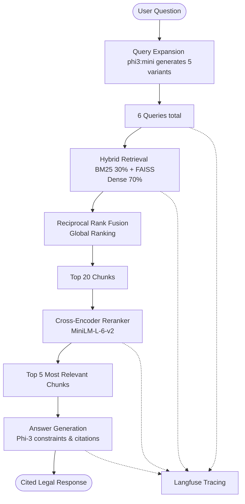

# LexRetriever

An advanced, production-ready Legal retrieval-augmented generation (RAG) system featuring hybrid retrieval, query expansion, reciprocal rank fusion (RRF), cross-encoder reranking, strict citation enforcement, evaluation gating, and real-time observability.

---

## 🏛️ System Architecture

LexRetriever implements a multi-stage retrieval and reranking pipeline to ensure high-fidelity response generation from legal documents.



### Key Components

1. **Document Ingestion & Chunking**: Extracts text from PDF legal documents using `PyPDFLoader`, cleans the formatting, maps structural metadata (Act Name, Section, Page), and slices text using `RecursiveCharacterTextSplitter` (1000 chars, 200 overlap).
2. **Hybrid Search**: Combines keyword matching (BM25) with vector embeddings (FAISS index built via `nomic-embed-text`) using a weighted `EnsembleRetriever`.
3. **Multi-Query Expansion**: Broadens search intent by generating 5 alternative phrasing variations of the user's question via a local LLM.
4. **Reciprocal Rank Fusion (RRF)**: Merges the retrieval results of all query variants, resolving overlaps and scoring documents globally.
5. **Cross-Encoder Reranking**: Re-evaluates the top 20 candidate chunks for precise semantic alignment with the original query using `ms-marco-MiniLM-L-6-v2`.
6. **Response Generation with Citations**: Instructs `phi3:mini` under strict execution rules to cite sources using `[SOURCE=<Act>; SECTION=<Section>; PAGE=<Page>]`. If no information is found in the context, it returns `"Not found in documents."`.
7. **Observability**: Automatically captures span metrics, latencies (retrieval, reranking, generation), token cost estimation, and outputs logs to Langfuse.

---

## 🚀 Quickstart Guide

### Prerequisites

- **Python 3.10+**
- **Ollama** installed and running locally with the following models:
  ```bash
  ollama pull phi3:mini
  ollama pull nomic-embed-text
  ```

### Local Setup

1. **Clone & Install Dependencies**:
   ```bash
   pip install -r requirements.txt
   ```

2. **Configure Environment Variables**:
   Create a `.env` file in the root directory:
   ```env
   DATA_PATH=Data
   VECTOR_STORE_PATH=faiss_store
   LLM_MODEL=phi3:mini
   EMBED_MODEL=nomic-embed-text
   RERANKER_MODEL=cross-encoder/ms-marco-MiniLM-L-6-v2
   LANGFUSE_PUBLIC_KEY=your-langfuse-public-key
   LANGFUSE_SECRET_KEY=your-langfuse-secret-key
   LANGFUSE_BASE_URL=http://localhost:3000
   ```

3. **Start the API Backend**:
   ```bash
   uvicorn app:app --host 0.0.0.0 --port 8000
   ```

4. **Launch the User Interface**:
   Open [http://localhost:8000/](http://localhost:8000/) in your web browser.

---

## 🧪 Evaluation Gating

Run the validation suite to calculate Retrieval Recall, Citation Coverage, and Semantic Answer Similarity against the golden dataset:

```bash
# Run basic retrieval evaluation
python evaluation/evaluate.py --ci

# Run end-to-end evaluation including LLM response generation
python evaluation/evaluate.py --generate --ci
```

---

## 🐳 Docker Deployment

To build and spin up the backend application alone:

```bash
docker build -t lexretriever-app .
docker run -p 8000:8000 lexretriever-app
```

To run the complete observability stack, including **PostgreSQL**, **ClickHouse**, **Redis**, **MinIO**, **Langfuse Web Console**, and the **LexRetriever** API container:

```bash
docker-compose up -d
```
